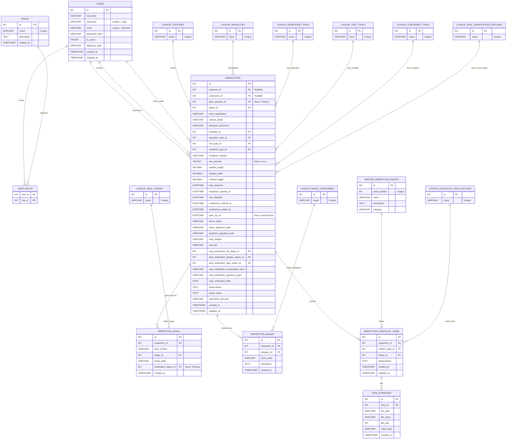

    
    <h1 align="center">Documentação do Banco de Dados - Inspeção Digital 8/18</h1>
    

        
        
        
    

<h2 id="visao-geral">📜 Visão Geral</h2>

    Este repositório contém toda a documentação, scripts e artefatos relacionados à camada de persistência da Aplicação
    de Inspeção Digital. O objetivo é servir como a <strong>fonte única da verdade</strong> para a estrutura de dados
    que suporta o sistema.

<h2 id="sumario">📖 Sumário</h2>
<ul>
    <li><a href="#guia-rapido">Guia Rápido (Como Começar)</a></li>
    <li><a href="#guia-de-contribuicao">Guia de Contribuição (Específico do BD)</a>
        <ul>
            <li><a href="#desenvolvimento-paralelo">O BD como Contrato para o Desenvolvimento Paralelo</a></li>
            <li><a href="#governanca-schema">Governança e Evolução do Schema</a></li>
            <li><a href="#scripts-uteis">Scripts Úteis para Desenvolvimento</a></li>
        </ul>
    </li>
    <li><a href="#arquitetura-dados">Arquitetura e Dicionário de Dados</a>
        <ul>
            <li><a href="#mer">Modelo de Entidade-Relacionamento (MER)</a></li>
            <li><a href="#dicionario-de-dados-completo">Dicionário de Dados Completo</a></li>
            <li><a href="#decisoes-design">Decisões de Design</a></li>
        </ul>
    </li>
    <li><a href="#detalhes-implementacao">Detalhes de Implementação</a></li>
</ul>

<h2 id="guia-rapido">🚀 Guia Rápido (Como Começar)</h2>

Esta seção é para você que precisa apenas "subir" o banco de dados para trabalhar em outra frente do projeto.

<h4>Para Desenvolvedores (Backend/Frontend)</h4>

    Para iniciar o banco de dados como parte do ambiente de desenvolvimento completo, execute o seguinte comando a
    partir da <strong>pasta raiz do projeto principal</strong>:

<pre><code># Usando Docker
docker compose up -d db

# Usando Podman

podman-compose up -d db</code></pre>

O banco de dados estará acessível em <code>localhost:3307</code> e pronto para ser consumido pela API.

<h4>Para DBAs e Desenvolvimento Focado no Banco</h4>

    Se você precisa trabalhar exclusively no schema, execute os comandos a partir <strong>desta pasta</strong>
    (<code>/checklist-8-18-bd</code>):

<pre><code>podman-compose up --build -d</code></pre>

    Na primeira execução, o container irá popular o banco com o schema e os dados iniciais, e em seguida, validará a
    lógica com o script <code>casosDeUso.sql</code>.

<h2 id="guia-de-contribuicao">🤝 Guia de Contribuição (Específico do BD)</h2>

    Para as diretrizes gerais do projeto (branching, PRs, etc.), consulte o <a href="../CONTRIBUTING.md">Guia de
        Contribuição Principal</a>. Abaixo estão as nuances específicas para trabalhar com o banco de dados.

<h3 id="desenvolvimento-paralelo">O Banco de Dados como Contrato para o Desenvolvimento Paralelo</h3>

    Nossa filosofia de trabalho visa minimizar bloqueios entre as equipes. O schema do banco de dados, definido e
    documentado neste repositório, funciona como um <strong>contrato imutável</strong> para o time de Backend.

<blockquote>
    

        <strong>Como isso funciona na prática?</strong> 
        Uma vez que uma nova estrutura de tabela ou coluna é definida, documentada no Dicionário de Dados e aprovada, o
        <strong>time de Backend não precisa esperar</strong> a migração ser aplicada em todos os ambientes. Eles podem
        imediatamente começar a desenvolver suas lógicas de negócio, mockando a camada de acesso a dados (repositórios)
        com base neste contrato.
    

</blockquote>

<h3 id="governanca-schema">Governança e Evolução do Schema ("Database First")</h3>

    A evolução do schema segue uma abordagem estrita e segura de <strong>"Database First"</strong>. A autoridade para
    modificar o schema pertence ao DBA, com validação do Product Owner (PO). A aplicação backend <strong>nunca</strong>
    deve alterar o banco (<code>DB_SYNCHRONIZE='false'</code>).

O fluxo para qualquer alteração é:

<ol>
    <li><strong>Proposta de Mudança:</strong> O Desenvolvedor ou PO formaliza a necessidade.</li>
    <li><strong>Análise e Aprovação:</strong> O PO valida o valor de negócio e o DBA analisa o impacto técnico.</li>
    <li><strong>Desenvolvimento da Migração:</strong> O DBA cria um script SQL de migração versionado (ex:
        <code>V2__Add_inspections_priority_column.sql</code>).
    </li>
    <li><strong>Aplicação Controlada:</strong> O DBA aplica o script nos ambientes.</li>
    <li><strong>Sincronização da Aplicação:</strong> Somente após a migração, o Desenvolvedor backend atualiza as
        entidades do TypeORM no código.</li>
</ol>

<h3 id="scripts-uteis">Scripts Úteis para Desenvolvimento e Validação</h3>
<ul>
    <li><strong><code>casosDeUso.sql</code>:</strong> Um script poderoso que simula os fluxos da aplicação diretamente
        no banco. Excelente para testar a integridade do modelo e otimizações.</li>
    <li><strong>Script de Limpeza:</strong> Antes de rodar o <code>casosDeUso.sql</code>, use o script de reset abaixo
        para limpar os dados transacionais e evitar conflitos.</li>
</ul>
<pre><code>-- Desativa a verificacao de chaves estrangeiras
SET FOREIGN_KEY_CHECKS = 0;
-- Limpa as tabelas transacionais
TRUNCATE TABLE `item_evidences`, `inspection_checklist_items`, `inspections`, `user_roles`, `users`;
-- Reativa a verificacao
SET FOREIGN_KEY_CHECKS = 1;</code></pre>

<h2 id="arquitetura-dados">🏛️ Arquitetura e Dicionário de Dados</h2>

<h3 id="mer">Modelo de Entidade-Relacionamento (MER)</h3>

O diagrama a seguir ilustra a estrutura das tabelas e seus relacionamentos.

<blockquote>
    <strong>Nota:</strong> O código abaixo é Mermaid. Se não for renderizado corretamente no seu visualizador, você pode
    usar um editor online como o <a href="https://mermaid.live/" target="_blank">Mermaid Live Editor</a> para colar o
    código e ver o diagrama.
</blockquote>
 

<h2 id="dicionario-de-dados-completo">📖 Dicionário de Dados Completo</h2>

A seguir, uma descrição detalhada de cada tabela e das suas respetivas colunas.

<h3>Tabelas de Autenticação e Acesso (RBAC)</h3>

Estas tabelas formam o sistema de Controle de Acesso Baseado em Funções (Role-Based Access Control).

<h4><strong><code>users</code></strong></h4>

Tabela central para armazenamento de usuários do sistema.

<table border="1" style="border-collapse: collapse; width:100%;">
    <thead>
        <tr>
            <th align="left">Nome da Coluna</th>
            <th align="left">Tipo de Dado</th>
            <th align="left">Chave</th>
            <th align="left">Nulo?</th>
            <th align="left">Descrição / Regra de Negócio</th>
            <th align="left">Exemplo</th>
        </tr>
    </thead>
    <tbody>
        <tr>
            <td><code>id</code></td>
            <td>INT</td>
            <td>PK</td>
            <td>Não</td>
            <td>Identificador único do usuário.</td>
            <td><code>1</code></td>
        </tr>
        <tr>
            <td><code>full_name</code></td>
            <td>VARCHAR(255)</td>
            <td></td>
            <td>Não</td>
            <td>Nome completo do usuário.</td>
            <td><code>"Carlos Inspetor"</code></td>
        </tr>
        <tr>
            <td><code>username</code></td>
            <td>VARCHAR(50)</td>
            <td>UNIQUE</td>
            <td>Não</td>
            <td>Login principal do usuário.</td>
            <td><code>"cinspetor"</code></td>
        </tr>
        <tr>
            <td><code>email</code></td>
            <td>VARCHAR(255)</td>
            <td>UNIQUE</td>
            <td>Sim</td>
            <td>Email opcional. Se preenchido, deve ser único.</td>
            <td><code>"inspetor@uaga.com.br"</code></td>
        </tr>
        <tr>
            <td><code>password_hash</code></td>
            <td>VARCHAR(255)</td>
            <td></td>
            <td>Não</td>
            <td>Hash da senha (bcrypt).</td>
            <td><code>"$2y$..."</code></td>
        </tr>
        <tr>
            <td><code>is_active</code></td>
            <td>TINYINT(1)</td>
            <td></td>
            <td>Não</td>
            <td>Status do usuário (1=Ativo, 0=Inativo).</td>
            <td><code>1</code></td>
        </tr>
        <tr>
            <td><code>signature_path</code></td>
            <td>VARCHAR(512)</td>
            <td></td>
            <td>Sim</td>
            <td>Caminho da imagem da assinatura pessoal do usuário.</td>
            <td><code>"/signatures/user_1.png"</code></td>
        </tr>
    </tbody>
</table>

<h4><strong><code>roles</code></strong></h4>

Define as funções (perfis) de usuário no sistema.

<table border="1" style="border-collapse: collapse; width:100%;">
    <thead>
        <tr>
            <th align="left">Nome da Coluna</th>
            <th align="left">Tipo de Dado</th>
            <th align="left">Chave</th>
            <th align="left">Nulo?</th>
            <th align="left">Descrição</th>
            <th align="left">Exemplo</th>
        </tr>
    </thead>
    <tbody>
        <tr>
            <td><code>id</code></td>
            <td>INT</td>
            <td>PK</td>
            <td>Não</td>
            <td>Identificador único da função.</td>
            <td><code>3</code></td>
        </tr>
        <tr>
            <td><code>name</code></td>
            <td>VARCHAR(50)</td>
            <td>UNIQUE</td>
            <td>Não</td>
            <td>Nome único da função (ex: ADMIN, CONFERENTE).</td>
            <td><code>"INSPECTOR"</code></td>
        </tr>
    </tbody>
</table>

<h4><strong><code>user_roles</code></strong></h4>

Tabela de junção para associar usuários a funções (relação N:M).

<table border="1" style="border-collapse: collapse; width:100%;">
    <thead>
        <tr>
            <th align="left">Nome da Coluna</th>
            <th align="left">Tipo de Dado</th>
            <th align="left">Chave</th>
            <th align="left">Nulo?</th>
            <th align="left">Descrição</th>
        </tr>
    </thead>
    <tbody>
        <tr>
            <td><code>user_id</code></td>
            <td>INT</td>
            <td>PK, FK</td>
            <td>Não</td>
            <td>Ref. <code>users</code>.</td>
        </tr>
        <tr>
            <td><code>role_id</code></td>
            <td>INT</td>
            <td>PK, FK</td>
            <td>Não</td>
            <td>Ref. <code>roles</code>.</td>
        </tr>
    </tbody>
</table>

<h3>Tabelas de Lookup (Mestras)</h3>

Contêm valores estáticos para garantir consistência em toda a aplicação.

<table border="1" style="border-collapse: collapse; width:100%;">
    <thead>
        <tr>
            <th align="left">Tabela</th>
            <th align="left">Descrição</th>
        </tr>
    </thead>
    <tbody>
        <tr>
            <td><code>lookup_statuses</code></td>
            <td>Estados da inspeção (ex: AGUARDANDO_INSPECAO, EM_CONFERENCIA, CORRECAO_DOCUMENTAL).</td>
        </tr>
        <tr>
            <td><code>lookup_modalities</code></td>
            <td>Modalidades (RODOVIARIO, MARITIMO, AEREO).</td>
        </tr>
        <tr>
            <td><code>lookup_operation_types</code></td>
            <td>Tipos de operação (VERDE, LARANJA, VERMELHA).</td>
        </tr>
        <tr>
            <td><code>lookup_unit_types</code></td>
            <td>Tipos de unidade (CONTAINER, BAU).</td>
        </tr>
        <tr>
            <td><code>lookup_container_types</code></td>
            <td>Tipos de container (DRY_20, REEFER_40).</td>
        </tr>
        <tr>
            <td><code>lookup_checklist_item_statuses</code></td>
            <td>Status do item (CONFORME, NAO_CONFORME).</td>
        </tr>
        <tr>
            <td><code>lookup_seal_verification_statuses</code></td>
            <td>Validação de lacres (OK, NAO_OK).</td>
        </tr>
        <tr>
            <td><code>lookup_seal_stages</code></td>
            <td>Etapas do lacre (INITIAL, FINAL, CONFERENCE, RFB, ARMADOR).</td>
        </tr>
        <tr>
            <td><code>lookup_image_categories</code></td>
            <td>Categorias de fotos (PLATE, PANORAMIC, PRECINTO_FRONT, etc.).</td>
        </tr>
    </tbody>
</table>

<h3>Tabelas Principais</h3>

<h4><strong><code>master_inspection_points</code></strong></h4>

Definição imutável dos 18 pontos de inspeção.

<table border="1" style="border-collapse: collapse; width:100%;">
    <thead>
        <tr>
            <th align="left">Nome da Coluna</th>
            <th align="left">Tipo de Dado</th>
            <th align="left">Chave</th>
            <th align="left">Nulo?</th>
            <th align="left">Descrição</th>
        </tr>
    </thead>
    <tbody>
        <tr>
            <td><code>id</code></td>
            <td>INT</td>
            <td>PK</td>
            <td>Não</td>
            <td>ID do ponto.</td>
        </tr>
        <tr>
            <td><code>point_number</code></td>
            <td>INT</td>
            <td>UNIQUE</td>
            <td>Não</td>
            <td>Número oficial (1 a 18).</td>
        </tr>
        <tr>
            <td><code>name</code></td>
            <td>VARCHAR(255)</td>
            <td></td>
            <td>Não</td>
            <td>Nome do ponto.</td>
        </tr>
        <tr>
            <td><code>category</code></td>
            <td>VARCHAR(50)</td>
            <td></td>
            <td>Não</td>
            <td>Categoria ('VEICULO' ou 'CONTEINER').</td>
        </tr>
    </tbody>
</table>

<h4><strong><code>inspections</code></strong></h4>

Tabela central que armazena o cabeçalho e o ciclo de vida da inspeção.

<table border="1" style="border-collapse: collapse; width:100%;">
    <thead>
        <tr>
            <th align="left">Nome da Coluna</th>
            <th align="left">Tipo de Dado</th>
            <th align="left">Chave</th>
            <th align="left">Nulo?</th>
            <th align="left">Descrição / Regra de Negócio</th>
        </tr>
    </thead>
    <tbody>
        <tr>
            <td><code>id</code></td>
            <td>INT</td>
            <td>PK</td>
            <td>Não</td>
            <td>ID único da inspeção.</td>
        </tr>
        <tr>
            <td><code>inspector_id</code></td>
            <td>INT</td>
            <td>FK</td>
            <td>Sim</td>
            <td>Usuário Inspetor (Nulo até assumir a tarefa).</td>
        </tr>
        <tr>
            <td><code>conferente_id</code></td>
            <td>INT</td>
            <td>FK</td>
            <td>Sim</td>
            <td>Usuário Conferente (Nulo até assumir a tarefa).</td>
        </tr>
        <tr>
            <td><code>gate_operator_id</code></td>
            <td>INT</td>
            <td>FK</td>
            <td>Sim</td>
            <td>Usuário da Portaria que liberou a saída física.</td>
        </tr>
        <tr>
            <td><code>status_id</code></td>
            <td>INT</td>
            <td>FK</td>
            <td>Não</td>
            <td>Status atual do processo (ref. <code>lookup_statuses</code>).</td>
        </tr>
        <tr>
            <td><code>entry_registration</code></td>
            <td>VARCHAR(100)</td>
            <td></td>
            <td>Não</td>
            <td>Registro de entrada (RE).</td>
        </tr>
        <tr>
            <td><code>vehicle_plates</code></td>
            <td>VARCHAR(20)</td>
            <td></td>
            <td>Não</td>
            <td>Placa do veículo.</td>
        </tr>
        <tr>
            <td><code>container_number</code></td>
            <td>VARCHAR(20)</td>
            <td></td>
            <td>Sim</td>
            <td>Número do container (se aplicável).</td>
        </tr>
        <tr>
            <td><code>has_precinto</code></td>
            <td>TINYINT(1)</td>
            <td></td>
            <td>Não</td>
            <td>Indica se a carga possui precinto/isca (1=Sim, 0=Não). Definido pelo Conferente.</td>
        </tr>
        <tr>
            <td><code>start_datetime</code></td>
            <td>DATETIME</td>
            <td></td>
            <td>Não</td>
            <td>Criação da inspeção pelo Documental.</td>
        </tr>
        <tr>
            <td><code>inspection_started_at</code></td>
            <td>DATETIME</td>
            <td></td>
            <td>Sim</td>
            <td>Início efetivo da inspeção (Checklist).</td>
        </tr>
        <tr>
            <td><code>end_datetime</code></td>
            <td>DATETIME</td>
            <td></td>
            <td>Sim</td>
            <td>Finalização da inspeção pelo Inspetor (Aprovado/Reprovado).</td>
        </tr>
        <tr>
            <td><code>conference_started_at</code></td>
            <td>DATETIME</td>
            <td></td>
            <td>Sim</td>
            <td>Início da conferência (Deslacre/Carga).</td>
        </tr>
        <tr>
            <td><code>conference_ended_at</code></td>
            <td>DATETIME</td>
            <td></td>
            <td>Sim</td>
            <td>Finalização total (Saída do Conferente).</td>
        </tr>
        <tr>
            <td><code>gate_out_at</code></td>
            <td>DATETIME</td>
            <td></td>
            <td>Sim</td>
            <td>Data/Hora da saída física do veículo (Registrado pela Portaria).</td>
        </tr>
        <tr>
            <td><code>seal_shipper</code></td>
            <td>VARCHAR(100)</td>
            <td></td>
            <td>Sim</td>
            <td>Lacre do Armador (entrada).</td>
        </tr>
        <tr>
            <td><code>seal_rfb</code></td>
            <td>VARCHAR(100)</td>
            <td></td>
            <td>Sim</td>
            <td>Lacre da RFB (entrada).</td>
        </tr>
        <tr>
            <td><code>generated_pdf_path</code></td>
            <td>VARCHAR(512)</td>
            <td></td>
            <td>Sim</td>
            <td>Link para o PDF final.</td>
        </tr>
    </tbody>
</table>

<h4><strong><code>inspection_seals</code></strong></h4>

Tabela normalizada para armazenar múltiplos lacres em diferentes etapas (1:N).

<table border="1" style="border-collapse: collapse; width:100%;">
    <thead>
        <tr>
            <th align="left">Nome da Coluna</th>
            <th align="left">Tipo de Dado</th>
            <th align="left">Chave</th>
            <th align="left">Nulo?</th>
            <th align="left">Descrição</th>
        </tr>
    </thead>
    <tbody>
        <tr>
            <td><code>id</code></td>
            <td>INT</td>
            <td>PK</td>
            <td>Não</td>
            <td>ID único do registro de lacre.</td>
        </tr>
        <tr>
            <td><code>inspection_id</code></td>
            <td>INT</td>
            <td>FK</td>
            <td>Não</td>
            <td>Vínculo com a inspeção.</td>
        </tr>
        <tr>
            <td><code>seal_number</code></td>
            <td>VARCHAR(100)</td>
            <td></td>
            <td>Não</td>
            <td>Código do lacre lido/inserido.</td>
        </tr>
        <tr>
            <td><code>stage_id</code></td>
            <td>INT</td>
            <td>FK</td>
            <td>Não</td>
            <td>Etapa (ref. <code>lookup_seal_stages</code>).</td>
        </tr>
        <tr>
            <td><code>photo_path</code></td>
            <td>VARCHAR(512)</td>
            <td></td>
            <td>Sim</td>
            <td>Foto evidência do lacre.</td>
        </tr>
        <tr>
            <td><code>verification_status_id</code></td>
            <td>INT</td>
            <td>FK</td>
            <td>Sim</td>
            <td>Validação individual na Portaria (OK/NOK).</td>
        </tr>
    </tbody>
</table>

<h4><strong><code>inspection_images</code></strong></h4>

Tabela normalizada para armazenar fotos gerais da carga e veículo (1:N).

<table border="1" style="border-collapse: collapse; width:100%;">
    <thead>
        <tr>
            <th align="left">Nome da Coluna</th>
            <th align="left">Tipo de Dado</th>
            <th align="left">Chave</th>
            <th align="left">Nulo?</th>
            <th align="left">Descrição</th>
        </tr>
    </thead>
    <tbody>
        <tr>
            <td><code>id</code></td>
            <td>INT</td>
            <td>PK</td>
            <td>Não</td>
            <td>ID único da imagem.</td>
        </tr>
        <tr>
            <td><code>inspection_id</code></td>
            <td>INT</td>
            <td>FK</td>
            <td>Não</td>
            <td>Vínculo com a inspeção.</td>
        </tr>
        <tr>
            <td><code>category_id</code></td>
            <td>INT</td>
            <td>FK</td>
            <td>Não</td>
            <td>Tipo (ref. <code>lookup_image_categories</code>).</td>
        </tr>
        <tr>
            <td><code>photo_path</code></td>
            <td>VARCHAR(512)</td>
            <td></td>
            <td>Não</td>
            <td>Caminho do arquivo.</td>
        </tr>
        <tr>
            <td><code>description</code></td>
            <td>TEXT</td>
            <td></td>
            <td>Sim</td>
            <td>Descrição opcional da imagem.</td>
        </tr>
    </tbody>
</table>

<h4><strong><code>inspection_checklist_items</code></strong></h4>

Status de cada um dos 18 pontos do checklist.

<table border="1" style="border-collapse: collapse; width:100%;">
    <thead>
        <tr>
            <th align="left">Nome da Coluna</th>
            <th align="left">Tipo de Dado</th>
            <th align="left">Chave</th>
            <th align="left">Nulo?</th>
            <th align="left">Descrição</th>
        </tr>
    </thead>
    <tbody>
        <tr>
            <td><code>id</code></td>
            <td>INT</td>
            <td>PK</td>
            <td>Não</td>
            <td>ID do item.</td>
        </tr>
        <tr>
            <td><code>inspection_id</code></td>
            <td>INT</td>
            <td>FK</td>
            <td>Não</td>
            <td>Vínculo com a inspeção.</td>
        </tr>
        <tr>
            <td><code>master_point_id</code></td>
            <td>INT</td>
            <td>FK</td>
            <td>Não</td>
            <td>Qual ponto está sendo avaliado (1-18).</td>
        </tr>
        <tr>
            <td><code>status_id</code></td>
            <td>INT</td>
            <td>FK</td>
            <td>Não</td>
            <td>Conforme, Não Conforme ou N/A (ref. <code>lookup_checklist_item_statuses</code>).</td>
        </tr>
        <tr>
            <td><code>observations</code></td>
            <td>TEXT</td>
            <td></td>
            <td>Sim</td>
            <td>Observações do inspetor.</td>
        </tr>
    </tbody>
</table>

<h4><strong><code>item_evidences</code></strong></h4>

Evidências (fotos) atreladas a um item específico do checklist (ex: foto de um pneu furado).

<table border="1" style="border-collapse: collapse; width:100%;">
    <thead>
        <tr>
            <th align="left">Nome da Coluna</th>
            <th align="left">Tipo de Dado</th>
            <th align="left">Chave</th>
            <th align="left">Nulo?</th>
            <th align="left">Descrição</th>
        </tr>
    </thead>
    <tbody>
        <tr>
            <td><code>id</code></td>
            <td>INT</td>
            <td>PK</td>
            <td>Não</td>
            <td>ID da evidência.</td>
        </tr>
        <tr>
            <td><code>item_id</code></td>
            <td>INT</td>
            <td>FK</td>
            <td>Não</td>
            <td>Vínculo com o item do checklist.</td>
        </tr>
        <tr>
            <td><code>file_path</code></td>
            <td>VARCHAR(512)</td>
            <td></td>
            <td>Não</td>
            <td>Caminho do arquivo.</td>
        </tr>
    </tbody>
</table>

<h2 id="fluxo-dados">🔄 Fluxo de Dados e Ciclo de Vida</h2>

    Esta seção descreve como os dados transitam pelo sistema, desde a criação da inspeção até o arquivamento na saída do veículo.

```mermaid
stateDiagram-v2
    direction LR

    %% Atores e Estados Iniciais
    state "Criação (Documental)" as DocStart {
        [*] --> AGUARDANDO_INSPECAO: Insert Inicial
    }

    state "Inspeção Física (Inspetor)" as Insp {
        AGUARDANDO_INSPECAO --> EM_INSPECAO: Inspetor assume
        EM_INSPECAO --> APROVADO: Checklist OK
        EM_INSPECAO --> REPROVADO: Checklist NOK
        
        REPROVADO --> REPROVADO_POS_AVALIACAO: Doc confirma erro
        REPROVADO --> APROVADO_COM_RESSALVAS: Doc aceita risco
        
        APROVADO --> AGUARDANDO_LACRACAO: Auto-transição
        APROVADO_COM_RESSALVAS --> AGUARDANDO_LACRACAO: Auto-transição
        
        AGUARDANDO_LACRACAO --> AGUARDANDO_CONFERENCIA: Fotos/Lacres Iniciais
    }

    state "Conferência (Conferente)" as Conf {
        AGUARDANDO_CONFERENCIA --> EM_CONFERENCIA: Início Carregamento
        EM_CONFERENCIA --> CONFERENCIA_FINALIZADA: Fim Carregamento
    }

    state "Documental Final" as DocEnd {
        CONFERENCIA_FINALIZADA --> AGUARDANDO_SAIDA: Lacração Fiscal (RFB)
    }

    state "Portaria (Gate Out)" as Gate {
        AGUARDANDO_SAIDA --> CORRECAO_DOCUMENTAL: Dados Incorretos
        CORRECAO_DOCUMENTAL --> AGUARDANDO_SAIDA: Correção Realizada
        
        AGUARDANDO_SAIDA --> FINALIZADO: Saída Confirmada
        FINALIZADO --> [*]
    }
```

    O status da inspeção (<code>status_id</code>) atua como o cursor que move o processo entre os diferentes atores.

<h3>Máquina de Estados (State Machine)</h3>

O diagrama abaixo ilustra todas as transições possíveis de status no banco de dados.

<h3>Detalhamento das Etapas de Persistência</h3>

<table border="1" style="border-collapse: collapse; width:100%;"> <thead> <tr> <th width="15%">Etapa / Ator</th> <th width="35%">Dados Criados/Alterados</th> <th width="50%">Descrição do Fluxo</th> </tr> </thead> <tbody> <tr> <td><strong>1. Criação</strong>

<em>(Documental)</em></td> <td> <ul> <li><code>inspections</code> (INSERT)</li> <li><code>start_datetime</code></li> </ul> </td> <td>O Documental cria o "cabeçalho" da inspeção com Placa, Container e Modalidade. O status nasce como <strong>AGUARDANDO_INSPECAO (4)</strong>.</td> </tr> <tr> <td><strong>2. Checklist</strong>

<em>(Inspetor)</em></td> <td> <ul> <li><code>inspection_started_at</code></li> <li><code>inspection_checklist_items</code></li> <li><code>item_evidences</code> (Fotos de Avarias)</li> <li><code>end_datetime</code> (Fim do Checklist)</li> </ul> </td> <td>O inspetor preenche os 18 pontos. Se tudo estiver OK, o sistema muda para <strong>APROVADO (2)</strong> e, imediatamente, para <strong>AGUARDANDO_LACRACAO (9)</strong>.</td> </tr> <tr> <td><strong>3. Lacração Inicial</strong>

<em>(Inspetor)</em></td> <td> <ul> <li><code>inspection_seals</code> (Stage: INITIAL)</li> <li><code>inspection_images</code> (Placa/Panorâmica)</li> </ul> </td> <td>O inspetor registra os lacres vazios e fotos obrigatórias. Ao salvar, o status muda para <strong>AGUARDANDO_CONFERENCIA (7)</strong>, tornando o item visível para o Conferente.</td> </tr> <tr> <td><strong>4. Conferência</strong>

<em>(Conferente)</em></td> <td> <ul> <li><code>conference_started_at</code></li> <li><code>has_precinto</code> (Flag Crítica)</li> <li><code>inspection_seals</code> (Stage: FINAL)</li> <li><code>inspection_images</code> (Precintos)</li> <li><code>conference_ended_at</code></li> </ul> </td> <td>O conferente inicia o carregamento. Ao finalizar, ele define se houve uso de Precinto Eletrônico (<code>has_precinto</code>). O status vai para <strong>CONFERENCIA_FINALIZADA (6)</strong>.</td> </tr> <tr> <td><strong>5. Lacração Fiscal</strong>

<em>(Documental)</em></td> <td> <ul> <li><code>inspection_seals</code> (Stage: RFB/ARMADOR)</li> </ul> </td> <td>O documental insere os lacres da Receita Federal e Armador. O status avança para <strong>AGUARDANDO_SAIDA (13)</strong>.</td> </tr> <tr> <td><strong>6. Saída (Gate Out)</strong>

<em>(Portaria)</em></td> <td> <ul> <li><code>gate_operator_id</code></li> <li><code>gate_out_at</code></li> <li><code>seal_verification_*</code> (Validação Grade)</li> <li><code>inspection_seals.verification_status_id</code></li> </ul> </td> <td>A portaria confere fisicamente os dados.

Se OK: status <strong>FINALIZADO (11)</strong> e gera PDF.

Se Erro: status <strong>CORRECAO_DOCUMENTAL (14)</strong> e volta para o Documental. </td> </tr> </tbody> </table>

<h3 id="decisoes-design">Decisões de Design (Normalização e Indexação)</h3>
<ul>
<li><strong>Normalização (3FN):</strong> O schema está na Terceira Forma Normal para eliminar redundância e garantir a consistência dos dados, principalmente através do uso intensivo de <strong>Tabelas de Lookup</strong> (<code>lookup_*</code>).</li>
<li><strong>Controle de Acesso (RBAC):</strong> Foi implementado um modelo padrão de <strong>Role-Based Access Control</strong> com as tabelas <code>users</code>, <code>roles</code>, e <code>user_roles</code>. Esta abordagem permite uma gestão de permissões flexível e escalável, alinhada com as diferentes "Jornadas de Usuário" da aplicação.</li>
<li><strong>Integridade Referencial:</strong> Todas as relações são reforçadas com chaves estrangeiras (<code>FK</code>), utilizando <code>ON DELETE CASCADE</code> onde apropriado (como em <code>user_roles</code>) para manter a consistência.</li>
<li><strong>Indexação:</strong> Índices foram criados em todas as colunas de chave estrangeira e em campos de busca comum (como <code>users.email</code>) para acelerar consultas e, crucialmente, para evitar <strong>table locks</strong> durante transações.</li>
<li><strong>Constraints de Unicidade:</strong> Foram aplicadas constraints <code>UNIQUE</code> em campos críticos como <code>users.email</code> e <code>roles.name</code> para garantir a integridade dos dados diretamente no nível do banco de dados.</li>
</ul>

<h2 id="detalhes-implementacao">⚙️ Detalhes de Implementação</h2>

Esta seção contém informações sobre os artefatos técnicos e o racional por trás das escolhas de tecnologia.

<h3>Script de Inicialização (init.sql)</h3>

O arquivo <code>init.sql</code> contém os comandos DDL (<code>CREATE TABLE</code>) e DML (<code>INSERT</code>) para
criar o schema completo, incluindo as tabelas de autenticação, e popular as tabelas mestras e de lookup com dados iniciais (ex: perfis de acesso padrão e um usuário administrador).

<h3>Tecnologia e Racional</h3>

O <strong>MySQL 8.0</strong> foi escolhido por ser uma tecnologia robusta e já existente na infraestrutura da UAGA.
A aplicação utiliza o ORM <strong>TypeORM</strong>, o que a desacopla da tecnologia específica do banco, permitindo
futuras migrações com impacto mínimo.

