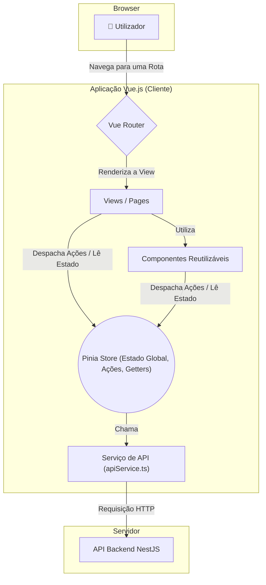

    
    
    <h1 align="center">Documentação do Frontend - Inspeção Digital 8/18</h1>
    

        
        
        
        
    

<h2 id="visao-geral">📜 Visão Geral</h2>

    Bem-vindo à aplicação cliente (Frontend) do sistema de Inspeção Digital. Esta é uma <strong>Single Page Application
        (SPA)</strong> construída com <strong>Vue.js 3</strong> e <strong>Vuetify</strong> para fornecer uma experiência
    de usuário reativa, moderna e totalmente responsiva, com foco em dispositivos móveis ("Mobile First").

<h2 id="sumario">📖 Sumário</h2>
<ul>
    <li><a href="#guia-rapido">Guia Rápido (Como Começar)</a></li>
    <li><a href="#guia-de-contribuicao">Guia de Contribuição (Específico do Frontend)</a>
        <ul>
            <li><a href="#desenvolvimento-paralelo">Trabalhando sem Bloqueios (Mockando a API)</a></li>
            <li><a href="#gestao-estado">Gestão de Estado e Fluxo de Dados</a></li>
            <li><a href="#testes">Cultura de Testes (Unit & E2E)</a></li>
        </ul>
    </li>
    <li><a href="#arquitetura-frontend">Arquitetura do Frontend</a></li>
    <li><a href="#estrutura-de-pastas">Estrutura de Pastas</a></li>
    <li><a href="#apendice">Apêndice: Guias Avançados</a></li>
</ul>

<h2 id="guia-rapido">🚀 Guia Rápido (Como Começar)</h2>
<h3 id="como-rodar">Como Rodar e Validar o Ambiente Local</h3>

    Nosso ambiente containerizado foi projetado para ser flexível, atendendo a duas necessidades principais do desenvolvedor.

<h4>Cenário 1: Desenvolvimento do Dia a Dia (Foco em UI e Testes Unitários)</h4>

    Este é o modo que você usará 90% do tempo. É otimizado para velocidade e hot-reload.

<pre><code>podman-compose up --build</code></pre>

    Ao executar este comando, o <code>entrypoint.sh</code> irá:

<ol>
    <li>Executar a suíte de <strong>testes unitários</strong>.</li>
    <li>Se passarem, iniciar o <strong>servidor de desenvolvimento Vite</strong>.</li>
    <li>A aplicação ficará acessível em <code>http://localhost:3000</code> com hot-reload.</li>
</ol>

<h4>Cenário 2: Validando o Fluxo Completo (Executando Testes E2E)</h4>

    Quando você finalizar uma feature e precisar garantir que o fluxo do usuário de ponta a ponta está a funcionar, você usará este comando.

<pre><code>RUN_E2E=true podman-compose up --build</code></pre>

    <strong>O que este comando faz?</strong> Ao passar a variável de ambiente <code>RUN_E2E=true</code>, você instrui o nosso <code>entrypoint.sh</code> a executar a <strong>pipeline de validação completa</strong>:

<ol>
    <li>Executa os <strong>testes unitários</strong>.</li>
    <li>Se passarem, executa o <strong>build de produção</strong> (<code>yarn build</code>) para garantir que não há erros de compilação.</li>
    <li>Se o build for bem-sucedido, ele executa a sua suíte de <strong>testes E2E (Cypress)</strong>.</li>
    <li>Ao final, o processo é encerrado com sucesso ou falha, sem iniciar o servidor de desenvolvimento.</li>
</ol>

    Este é o fluxo que você deve rodar antes de abrir uma Pull Request para garantir a qualidade da sua entrega.

    Para instruções de execução local (standalone) e detalhes sobre testes, consulte o <strong><a
            href="#apendice">Apêndice de Guias Avançados</a></strong>.

<h2 id="guia-de-contribuicao">🤝 Guia de Contribuição (Específico do Frontend)</h2>

    Para as diretrizes gerais do projeto (branching, PRs, DoD, etc.), consulte o <a href="../CONTRIBUTING.md">Guia de
        Contribuição Principal</a>. Abaixo estão as nuances específicas para o desenvolvimento do frontend.

<h3 id="desenvolvimento-paralelo">Trabalhando sem Bloqueios (Mockando a API)</h3>

    A equipe de frontend <strong>não precisa esperar</strong> que os endpoints do backend estejam 100% implementados.
    Nosso fluxo de trabalho é baseado no conceito de <strong>"API como Contrato"</strong>.

<blockquote>
    

        <strong>Como isso funciona na prática?</strong> 
        1. O time de backend define o contrato da API primeiro (endpoint, formato do DTO de requisição e resposta) e o
        disponibiliza via <strong>Swagger</strong>. 
        2. Com este contrato, o time de frontend pode usar o <strong>Cypress</strong> e seu comando
        <code>cy.intercept()</code> para simular (mockar) as respostas da API. 
        3. Os arquivos JSON na pasta <code>/cypress/fixtures</code> servem como nossa "base de dados mock". Você pode
        criar novos fixtures para testar diferentes cenários da UI (sucesso, erro, dados vazios, etc.).
    

    

        Esta abordagem nos permite desenvolver a interface e os fluxos de usuário em paralelo com o backend, testando
        todos os estados da UI de forma determinística.
    

</blockquote>

<h3 id="gestao-estado">Gestão de Estado e Fluxo de Dados</h3>

    Para garantir a previsibilidade e a manutenibilidade, todo o estado global da aplicação é gerenciado pelo
    <strong>Pinia</strong>. O fluxo de dados deve sempre seguir este padrão:

<ol>
    <li>O <strong>Componente</strong> invoca uma <strong>Ação (Action)</strong> na Store.</li>
    <li>A <strong>Ação</strong> chama o <strong>Serviço de API</strong>.</li>
    <li>A <strong>Ação</strong> atualiza o <strong>Estado (State)</strong> com a resposta.</li>
    <li>O <strong>Componente</strong> reage à mudança no <strong>Estado</strong>.</li>
</ol>

    <strong>Nunca</strong> faça chamadas de API diretamente de um componente. Essa responsabilidade é exclusiva das
    stores Pinia.

<h3 id="testes">Cultura de Testes (Unit & E2E)</h3>
<ul>
    <li><strong>Vitest (Testes Unitários):</strong> Use para testar a lógica interna de componentes complexos, funções
        de utilidade ou a lógica síncrona dentro das stores Pinia.</li>
    <li><strong>Cypress (Testes End-to-End):</strong> A principal ferramenta de garantia de qualidade. <strong>Todo
            fluxo de usuário crítico deve ser coberto por um teste E2E</strong>. Use-o para validar a jornada do
        usuário, a integração entre componentes e a comunicação com a API (mockada ou real).</li>
</ul>

<h2 id="arquitetura-frontend">🏛️ Arquitetura do Frontend</h2>

    A aplicação segue uma arquitetura moderna baseada em componentes, com uma clara separação de responsabilidades para
    garantir a manutenibilidade e escalabilidade.

<h3>Fluxo de Dados e Componentes</h3>

    O diagrama abaixo ilustra como os componentes interagem entre si e com os serviços externos.

    Os pilares da arquitetura são os <strong>Componentes/Pages</strong> (a UI), a <strong>Store Pinia</strong> (o
    cérebro do estado) e o <strong>Serviço de API</strong> (a camada de comunicação).

<h4>Padrão de Fluxo de Dados na Prática</h4>

    Para garantir a consistência, o fluxo de dados para buscar ou enviar informações segue sempre o mesmo padrão:

<ol>
    <li>O <strong>Componente Vue</strong> (ex: uma página) precisa de dados ou precisa de executar uma ação.</li>
    <li>Ele <strong>chama uma <code>action</code></strong> da store Pinia correspondente (ex:
        <code>inspectionsStore.fetchInspections()</code>).</li>
    <li>A <strong><code>action</code> na store</strong> orquestra a lógica, chamando o
        <strong><code>apiService</code></strong> para fazer a requisição HTTP.</li>
    <li>O <strong><code>apiService</code></strong> retorna os dados para a <code>action</code>.</li>
    <li>A <strong><code>action</code> atualiza o <code>state</code></strong> da store com os novos dados (ex:
        <code>this.inspections = data</code>).</li>
    <li>Graças à reatividade do Vue, o <strong>Componente</strong>, que estava a "ouvir" o estado da store, atualiza-se
        automaticamente para exibir os novos dados.</li>
</ol>

<h3>Os Pilares da Arquitetura Frontend</h3>
<ul>
    <li>
        <strong>Views/Pages (<code>/pages</code>):</strong> São os componentes de mais alto nível, cada um representando
        uma "tela" da aplicação. Eles são responsáveis por orquestrar os componentes menores e comunicar-se com a store
        Pinia para buscar e enviar dados.
    </li>
    <li>
        <strong>Componentes (<code>/components</code>):</strong> Peças de UI reutilizáveis e, idealmente, "burras".
        Recebem dados via <em>props</em> e emitem eventos para comunicar-se com os seus componentes pais.
    </li>
    <li>
        <strong>Pinia (<code>/stores</code>):</strong> O cérebro do estado do frontend. Cada ficheiro representa um
        "slice" do estado global (ex: inspections), contendo o <code>state</code>, <code>getters</code> (dados
        computados) e <code>actions</code> (métodos que alteram o estado, muitas vezes de forma assíncrona, chamando o
        serviço de API).
    </li>
    <li>
        <strong>Serviço de API (<code>/services</code>):</strong> Uma camada de abstração que isola toda a comunicação
        com o backend. Nenhum componente ou store faz uma chamada <code>fetch</code> diretamente; eles sempre passam
        pelo apiService, o que torna a manutenção e os testes muito mais fáceis.
    </li>
</ul>

<h2 id="estrutura-de-pastas">📁 Estrutura de Pastas</h2>

    A estrutura de pastas do projeto foi organizada para promover a separação de responsabilidades e a escalabilidade,
    seguindo as convenções do ecossistema Vue.js e Vite.

<pre><code>.
├── cypress/
│   ├── e2e/         # Os ficheiros de teste End-to-End
│   ├── fixtures/    # Dados mock (JSON, imagens) para os testes
│   └── support/     # Comandos customizados e configuração do Cypress
├── public/          # Ativos estáticos que não são processados pelo build
└── src/
    ├── assets/      # Imagens, fontes e outros ativos processados pelo Vite
    ├── components/  # Componentes Vue reutilizáveis (botões, cards, etc.)
    ├── layouts/     # Estruturas de página (ex: layout padrão com navbar)
    ├── models/      # Interfaces e tipos TypeScript para os dados da aplicação
    ├── pages/       # As telas principais da aplicação (views)
    ├── plugins/     # Configuração de plugins do Vue (Vuetify, etc.)
    ├── router/      # Configuração do Vue Router
    ├── services/    # Camada de comunicação com a API backend
    ├── stores/      # Módulos da store Pinia para gestão de estado
    ├── styles/      # Ficheiros de estilos globais (CSS, SCSS)
    ├── App.vue      # O componente raiz da aplicação
    └── main.ts      # O ponto de entrada da aplicação Vue
</code></pre>

<ul>
    <li>
        <code><strong>/src</strong></code>: Contém todo o código-fonte da aplicação.
        <ul>
            <li><code>/pages</code>: O coração visual da aplicação. Cada ficheiro <code>.vue</code> aqui representa uma
                página/rota. A estrutura de pastas aqui dentro define as rotas da aplicação (ex:
                <code>/pages/inspections/[id]/index.vue</code> torna-se a rota <code>/inspections/:id</code>).</li>
            <li><code>/components</code>: Contém os blocos de construção da UI. São componentes reutilizáveis (ex: um
                seletor de data customizado, um card de inspeção) que são importados pelas <code>pages</code>.</li>
            <li><code>/stores</code>: O cérebro do estado do frontend. Usando <strong>Pinia</strong>, cada ficheiro aqui
                (ex: <code>inspections.ts</code>) gere uma fatia do estado global, contendo o <code>state</code>,
                <code>getters</code> (dados computados) e <code>actions</code> (métodos para alterar o estado e
                comunicar com a API).</li>
            <li><code>/services</code>: Isola toda a lógica de comunicação com o backend. O <code>apiService.ts</code> é
                o único ficheiro que faz chamadas <code>fetch</code>, tornando a aplicação fácil de manter e testar.
            </li>
            <li><code>/models</code>: Define as "formas" dos nossos dados usando interfaces TypeScript (ex:
                <code>Inspection</code>, <code>ItemEvidence</code>), garantindo a consistência dos dados em toda a
                aplicação.</li>
            <li><code>/router</code>: Configura o <strong>Vue Router</strong>, definindo como as URLs são mapeadas para
                os componentes de página.</li>
        </ul>
    </li>
    <li>
        <code><strong>/cypress</strong></code>: Contém todos os testes <strong>End-to-End (E2E)</strong>.
        <ul>
            <li><code>/e2e</code>: Os cenários de teste escritos em Cypress, que simulam a jornada de um usuário real no
                navegador.</li>
            <li><code>/fixtures</code>: "Base de dados" para os testes E2E. Contém ficheiros JSON que simulam as
                respostas da API e imagens de teste.</li>
            <li><code>/support</code>: Ficheiros de configuração e comandos customizados do Cypress para simplificar a
                escrita dos testes.</li>
        </ul>
    </li>
</ul>

<h2 id="convencoes-estilizacao">🎨 Convenções de Estilização</h2>

    Para manter a consistência visual, o projeto adota as seguintes convenções:

<ul>
    <li><strong>Componentes Scoped:</strong> Por padrão, os estilos dentro de um componente <code>.vue</code> devem ser
        "scoped" (usando a tag <code>&lt;style scoped&gt;</code>) para evitar que afetem outros componentes.</li>
    <li><strong>Estilos Globais:</strong> Estilos que precisam de ser aplicados globalmente (ex: reset, classes de
        utilidade) devem residir na pasta <code>/src/styles</code>.</li>
    <li><strong>Variáveis Vuetify:</strong> Para customizações do tema (cores, fontes), deve-se dar preferência à
        alteração das variáveis SASS do Vuetify, conforme a sua documentação oficial.</li>
</ul>

<h2 id="apendice">📚 Apêndice: Guias Avançados</h2>

    
<strong>Clique para expandir: Ambiente de Desenvolvimento e Testes (Detalhado)</strong>

    <h2 id="ambiente-de-desenvolvimento">🚀 Ambiente de Desenvolvimento e Testes</h2>
    

        Esta seção fornece um guia completo para configurar o ambiente, rodar o servidor de desenvolvimento e executar a
        suíte de testes automatizados do frontend.
    

    

        Ideal para desenvolvimento focado na UI, onde você pode querer mais controle sobre quando executar os testes.
    

    <ol>
        <li><strong>Pré-requisitos:</strong> Instale Node.js (v20+, recomendado via <a
                href="https://github.com/nvm-sh/nvm">nvm</a>) e Yarn.</li>
        <li><strong>Dependência Externa:</strong> Garanta que a <strong>API do backend esteja a ser executada</strong>
            (seja via contêiner ou localmente), pois o frontend precisa de se conectar a ela.</li>
        <li>Navegue até esta pasta: <code>cd checklist-8-18-front</code></li>
        <li><strong>Instalar Dependências:</strong>
            <pre><code>yarn install --frozen-lockfile</code></pre>
        </li>
        <li><strong>Configurar Variáveis de Ambiente:</strong> Copie <code>.env.example</code> para <code>.env</code> e
            certifique-se de que <code>VITE_API_BASE_URL</code> aponta para o endereço da sua API (ex:
            <code>http://localhost:8888</code>).</li>
        <li><strong>Iniciar Servidor de Desenvolvimento:</strong>
            <pre><code>yarn start:dev</code></pre> A aplicação estará disponível em <code>http://localhost:3000</code>
            com hot-reload.
        </li>
    </ol>
    <h4>Variáveis de Ambiente Disponíveis</h4>
    <table border="1" style="border-collapse: collapse; width:100%;">
        <thead>
            <tr bgcolor="#f2f2f2">
                <th align="left">Variável</th>
                <th align="left">Propósito</th>
                <th align="left">Obrigatória?</th>
                <th align="left">Exemplo</th>
            </tr>
        </thead>
        <tbody>
            <tr>
                <td><code>VITE_API_BASE_URL</code></td>
                <td>Define a URL base da API backend para a qual o frontend fará as requisições.</td>
                <td><strong>Sim</strong></td>
                <td><code>http://localhost:8888</code></td>
            </tr>
        </tbody>
    </table>
    

    <h3>🧪 Executando os Testes Automatizados Localmente</h3>
    

        A aplicação adota uma estratégia de testes em duas frentes para garantir a máxima qualidade.
    

    <h4>Testes Unitários e de Componentes (Vitest)</h4>
    

        <strong>Objetivo:</strong> Testar a lógica de componentes, serviços e stores Pinia de forma rápida e isolada.
    

    <pre><code># Executa todos os testes unitários uma vez
yarn test:unit</code></pre>
    <h4>Testes End-to-End (Cypress)</h4>
    

        <strong>Objetivo:</strong> Simular a jornada completa de um usuário real no navegador, validando os fluxos
        críticos de ponta a ponta.
    

    
Existem duas formas de executar os testes E2E:

    <ul>
        <li>
            <strong>Modo Headless (para CI ou verificação rápida):</strong> 
            Este comando inicia um servidor de teste, executa todos os testes do Cypress sem abrir a interface gráfica e
            depois desliga o servidor. É o mesmo comando executado no pipeline do Docker.
            <pre><code>yarn test:e2e</code></pre>
        </li>
        <li>
            <strong>Modo Interativo (para desenvolvimento e depuração):</strong> 
            Esta é a melhor forma para quando você está criando ou depurando um teste. Requer <strong>dois
                terminais</strong>:
            <ol>
                <li>No primeiro terminal, inicie o servidor de desenvolvimento:
                    <pre><code>yarn start:dev</code></pre>
                </li>
                <li>No segundo terminal, abra a interface do Cypress:
                    <pre><code>yarn cy:open</code></pre>
                </li>
            </ol>
        </li>
    </ul>
    

    <h3>📦 Build e Preview de Produção</h3>
    
Para verificar a versão de produção da sua aplicação antes do deploy.

    <ul>
        <li>
            <strong>Gerar o Build de Produção:</strong> 
            Este comando verifica os tipos com TypeScript e gera uma pasta <code>/dist</code> com os ficheiros estáticos
            otimizados.
            <pre><code>yarn build</code></pre>
        </li>
        <li>
            <strong>Pré-visualizar o Build:</strong> 
            Este comando inicia um servidor local simples que serve os ficheiros da pasta <code>/dist</code>, permitindo
            que você teste a versão de produção.
            <pre><code>yarn preview</code></pre>
        </li>
    </ul>

    
<strong>Clique para expandir: Deploy em Produção (IIS)</strong>

    <h2 id="deploy-em-producao-iis">🚢 Deploy em Produção (IIS)</h2>
    

        A publicação de uma aplicação frontend Vue.js (SPA) é um processo de servir ficheiros estáticos. É mais simples
        que o deploy do backend, mas requer uma configuração específica no IIS para lidar com o roteamento do Vue
        Router.
    

    <h3>Pré-requisitos no Servidor</h3>
    <ul>
        <li><strong>IIS</strong> (Serviços de Informação da Internet) ativado no Windows Server.</li>
        <li><strong>Módulo URL Rewrite:</strong> Essencial para o funcionamento das rotas da SPA. Pode ser baixado <a
                href="https://www.iis.net/downloads/microsoft/url-rewrite">aqui</a>.</li>
    </ul>
    <h3>Passos para o Deploy</h3>
    <ol>
        <li>
            <strong>Configurar a URL da API de Produção:</strong> 
            Antes de construir a aplicação, certifique-se de que o ficheiro <code>.env.production</code> contém a
            variável <code>VITE_API_BASE_URL</code> a apontar para o endereço público da sua API backend (ex:
            <code>https://api.suaempresa.com</code>). Esta URL será "embutida" nos ficheiros de produção.
        </li>
        <li>
            <strong>Build da Aplicação:</strong> 
            Execute o comando para gerar os ficheiros estáticos otimizados.
            <pre><code>yarn build</code></pre>
            Este comando irá criar uma pasta <code>/dist</code> com tudo o que é necessário para a produção.
        </li>
        <li>
            <strong>Transferência de Ficheiros:</strong> 
            Copie <strong>apenas o conteúdo</strong> da pasta <code>/dist</code> para a pasta do seu site no servidor
            (ex: <code>C:\inetpub\wwwroot\checklist-app</code>).
        </li>
        <li>
            <strong>Configurar o IIS:</strong> 
            No Gestor do IIS, crie um novo Site e aponte o seu caminho físico para a pasta onde você copiou os ficheiros
            (<code>C:\inetpub\wwwroot\checklist-app</code>).
        </li>
        <li>
            <strong>Criar o <code>web.config</code> para Roteamento de SPA:</strong> 
            Este é o passo mais importante. Crie um ficheiro chamado <code>web.config</code> na raiz da pasta no
            servidor. Este ficheiro instrui o IIS a redirecionar todas as requisições para o <code>index.html</code>,
            permitindo que o Vue Router controle a navegação.
            <pre><code>&lt;?xml version="1.0" encoding="UTF-8"?&gt;
&lt;configuration&gt;
  &lt;system.webServer&gt;
    &lt;rewrite&gt;
      &lt;rules&gt;
        &lt;rule name="Handle History Mode" stopProcessing="true"&gt;
          &lt;match url=".*" /&gt;
          &lt;conditions logicalGrouping="MatchAll"&gt;
            &lt;add input="{REQUEST_FILENAME}" matchType="IsFile" negate="true" /&gt;
            &lt;add input="{REQUEST_FILENAME}" matchType="IsDirectory" negate="true" /&gt;
          &lt;/conditions&gt;
          &lt;action type="Rewrite" url="/" /&gt;
        &lt;/rule&gt;
      &lt;/rules&gt;
    &lt;/rewrite&gt;
  &lt;/system.webServer&gt;
&lt;/configuration&gt;
</code></pre>
        </li>
        <li>
            <strong>Iniciar o Site:</strong> Inicie o site no IIS e a sua aplicação estará no ar, com o roteamento a
            funcionar perfeitamente mesmo que o usuário atualize a página numa rota interna como
            <code>/inspections/123</code>.
        </li>
    </ol>

    
<strong>Clique para expandir: Stack Tecnológico e Filosofia de Design</strong>

    <h3>Stack Tecnológico Completo</h3>
    <h2 id="stack-tecnologico">🛠️ Stack Tecnológico</h2>
    <table border="1" style="border-collapse: collapse; width:100%;">
        <thead bgcolor="#f2f2f2">
            <tr>
                <th align="left">Categoria</th>
                <th align="left">Tecnologia/Ferramenta</th>
                <th align="left">Propósito</th>
            </tr>
        </thead>
        <tbody>
            <tr>
                <td>Framework Principal</td>
                <td><strong>Vue.js 3</strong></td>
                <td>Reatividade, componentização e ecossistema (Composition API).</td>
            </tr>
            <tr>
                <td>Build Tool</td>
                <td><strong>Vite</strong></td>
                <td>Servidor de desenvolvimento ultra-rápido com Hot Module Replacement (HMR).</td>
            </tr>
            <tr>
                <td>Linguagem</td>
                <td><strong>TypeScript</strong></td>
                <td>Tipagem estática para um código mais seguro e manutenível.</td>
            </tr>
            <tr>
                <td>UI Framework</td>
                <td><strong>Vuetify 3</strong></td>
                <td>Biblioteca de componentes rica e responsiva baseada em Material Design.</td>
            </tr>
            <tr>
                <td>Gestão de Estado</td>
                <td><strong>Pinia</strong></td>
                <td>Gestor de estado global, centralizado e modular.</td>
            </tr>
            <tr>
                <td>Roteamento</td>
                <td><strong>Vue Router</strong></td>
                <td>Gestão de rotas para a Single Page Application (SPA).</td>
            </tr>
            <tr>
                <td>Testes Unitários</td>
                <td><strong>Vitest</strong></td>
                <td>Framework de testes unitários rápido e compatível com o ecossistema Vite.</td>
            </tr>
            <tr>
                <td>Testes E2E</td>
                <td><strong>Cypress</strong></td>
                <td>Testes de ponta a ponta que simulam a interação real do usuário no browser.</td>
            </tr>
            <tr>
                <td>Containerização</td>
                <td><strong>Docker / Podman</strong></td>
                <td>Ambiente de desenvolvimento e CI.</td>
            </tr>
        </tbody>
    </table>
    <h3>Filosofia e Decisões de Arquitetura</h3>
    <h3>Porquê uma Aplicação Web Responsiva?</h3>
    

        A decisão de construir uma aplicação web com Vue.js e Vuetify, em vez de uma aplicação nativa para smartphones
        (ex: Kotlin), foi uma escolha estratégica tomada pelo PO e Desenvolvedor do projeto, Leonardo Adler da Silva. A
        lógica por trás desta decisão baseia-se em três pilares:
    

    <ul>
        <li>
            <strong>Foco no "Mobile First", Sem Excluir o Desktop:</strong> O público-alvo principal são os inspetores
            que utilizam smartphones em campo. O Vuetify garante uma experiência de usuário nativa e totalmente
            responsiva. Ao mesmo tempo, a mesma aplicação serve perfeitamente os gestores e administradores que acessam
            aos relatórios via desktop, sem a necessidade de um segundo desenvolvimento.
        </li>
        <li>
            <strong>Agilidade e "Time-to-Market":</strong> Aproveitando a experiência prévia com Vue.js em três projetos
            anteriores, foi possível acelerar o desenvolvimento, reduzir a curva de aprendizado e entregar um MVP
            robusto num prazo mais curto.
        </li>
        <li>
            <strong>Sustentabilidade e "Matar Dois Coelhos com uma Cajadada":</strong> Desenvolver e manter duas
            aplicações separadas (mobile e desktop) seria um retrabalho significativo e aumentaria os custos de
            manutenção. Uma única base de código responsiva é uma solução mais eficiente, econômica e sustentável para o
            negócio.
        </li>
    </ul>
    

        Caso o futuro exija uma aplicação nativa, essa necessidade será adicionada ao backlog. No momento, a solução web
        atual atende a 100% dos requisitos do negócio.
    

