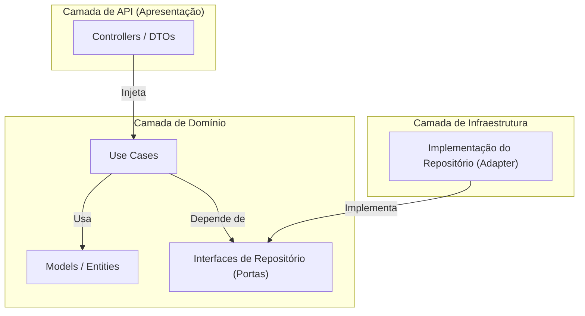
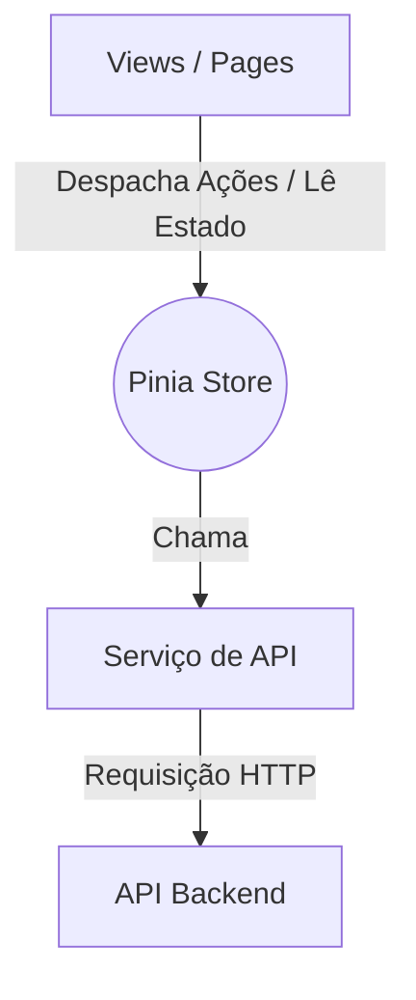

<h1 id="arquitetura-detalhada">🏛️ Arquitetura Detalhada da Solução</h1>

    Este documento fornece uma análise técnica aprofundada da arquitetura da Aplicação de Inspeção Digital. Ele serve como a fonte da verdade para as decisões de design, os padrões utilizados e a interação entre os diferentes componentes do sistema.

<h2 id="principios">Filosofia e Princípios de Arquitetura</h2>

    A arquitetura do sistema não é apenas um conjunto de tecnologias, mas a aplicação de princípios de engenharia de software que garantem a qualidade, manutenibilidade e escalabilidade do projeto a longo prazo.

<ul>
    <li><strong>Clean Architecture (Arquitetura Limpa):</strong> Nosso pilar central. As dependências apontam sempre para o interior, para o domínio. A lógica de negócio é pura, independente de frameworks, UI ou banco de dados.</li>
    <li><strong>Domain-Driven Design (DDD):</strong> Modelamos o software em torno do domínio do negócio de inspeções. As entidades, os casos de uso e os repositórios refletem a linguagem e os processos da área de negócio.</li>
    <li><strong>Tecnologia como Detalhe de Implementação:</strong> A escolha específica de Vue.js, NestJS ou MySQL é secundária à arquitetura. O design desacoplado permite que essas tecnologias sejam trocadas com impacto mínimo.</li>
    <li><strong>Qualidade Garantida por Automação:</strong> A qualidade não é uma etapa manual, mas um contrato automatizado. Nosso pipeline de CI/CD garante que todos os testes (unitários e E2E) passem antes de qualquer serviço ser iniciado.</li>
</ul>

<h2 id="visao-geral-3-camadas">Visão Geral da Arquitetura em 3 Camadas</h2>

    A aplicação é dividida em três camadas principais, desacopladas e com responsabilidades bem definidas, que se comunicam através de APIs e contratos claros.

    

<h2 id="detalhamento-camadas">Detalhamento por Camada</h2>

<h3 id="backend">1. Camada de Backend (O Coração do Sistema)</h3>

    A API, construída com <strong>NestJS</strong>, é onde reside toda a inteligência e lógica de negócio do sistema. Ela segue rigorosamente a <strong>Clean Architecture</strong>.

<ul>
    <li><strong>Camada de Domínio (<code>/domain</code>):</strong> O núcleo puro. Contém as <strong>Entidades</strong> (regras de negócio), <strong>Use Cases</strong> (orquestradores da lógica) e as <strong>Interfaces/Portas</strong> (ex: <code>IInspectionRepository</code>) que definem os contratos com o mundo exterior.</li>
    <li><strong>Camada de API (<code>/api</code>):</strong> A interface com o mundo. <strong>Controllers</strong> recebem requisições, validam <strong>DTOs</strong> e invocam o Use Case correspondente.</li>
    <li><strong>Camada de Infraestrutura (<code>/infra</code>):</strong> A implementação dos detalhes. <strong>Adaptadores</strong> (ex: <code>TypeOrmInspectionRepository</code>) implementam as interfaces do domínio. É a única camada que "sabe" que estamos usando TypeORM ou MySQL.</li>
</ul>

<h3 id="frontend">2. Camada de Frontend (A Experiência do Usuário)</h3>

    A SPA (Single Page Application), construída com <strong>Vue.js 3</strong>, é responsável por fornecer uma interface rica e reativa. Sua arquitetura é projetada para gerenciar o estado de forma previsível e isolar a comunicação com o backend.

    O fluxo de dados é <strong>unidirecional</strong> e gerenciado pelo <strong>Pinia</strong>: um componente dispara uma ação na store, a store chama o serviço de API, atualiza seu próprio estado com a resposta, e o componente reage a essa mudança de estado. Nenhum componente fala diretamente com a API.

<h3 id="banco-de-dados">3. Camada de Banco de Dados (A Fonte da Verdade)</h3>

    O banco de dados <strong>MySQL</strong> é a camada de persistência. O schema foi projetado com uma abordagem <strong>"Database First"</strong>, sendo a fonte da verdade para a estrutura dos dados.

    <em>(Consulte o <a href="../checklist-8-18-bd/README.md#mer">MER completo</a> no README do Banco de Dados)</em>

    As principais decisões de design incluem a <strong>Normalização (3FN)</strong> para consistência, o uso de <strong>Tabelas de Lookup</strong> para dados categóricos e uma <strong>estratégia de indexação</strong> proativa para garantir a performance das consultas e evitar problemas de concorrência.

<h2 id="fluxo-de-dados">Fluxo de Dados: Um Exemplo Prático</h2>

    Para ilustrar como as camadas colaboram, vamos seguir o fluxo de <strong>finalização de uma inspeção</strong>:

<ol>
    <li>O <strong>Usuário</strong> clica no botão "Finalizar" na interface (<strong>Frontend</strong>).</li>
    <li>O <strong>Componente Vue</strong> chama a ação <code>inspectionsStore.finalizeInspection(id)</code> (<strong>Pinia Store</strong>).</li>
    <li>A <strong>Store</strong> chama o <strong>Serviço de API</strong>, que faz uma requisição <code>PATCH /inspections/:id/finalize</code>.</li>
    <li>O <strong>Controller</strong> no <strong>Backend</strong> recebe a requisição e invoca o <code>FinalizeInspectionUseCase</code>.</li>
    <li>O <strong>Use Case</strong> (<strong>Domínio</strong>) usa a interface do <strong>Repositório</strong> para buscar a entidade <code>Inspection</code> do banco.</li>
    <li>O <strong>Use Case</strong> executa a lógica de negócio na <strong>Entidade</strong> (ex: <code>inspection.calculateFinalStatus()</code>).</li>
    <li>O <strong>Use Case</strong> usa o <strong>Repositório</strong> novamente para salvar a entidade atualizada no <strong>Banco de Dados</strong>.</li>
    <li>A <strong>API</strong> retorna a inspeção finalizada como resposta (<strong>JSON</strong>).</li>
    <li>O <strong>Serviço de API</strong> no frontend recebe a resposta e a repassa para a <strong>Store Pinia</strong>.</li>
    <li>A <strong>Store</strong> atualiza seu estado, e a <strong>UI</strong> é re-renderizada automaticamente para mostrar o status "Finalizado".</li>
</ol>